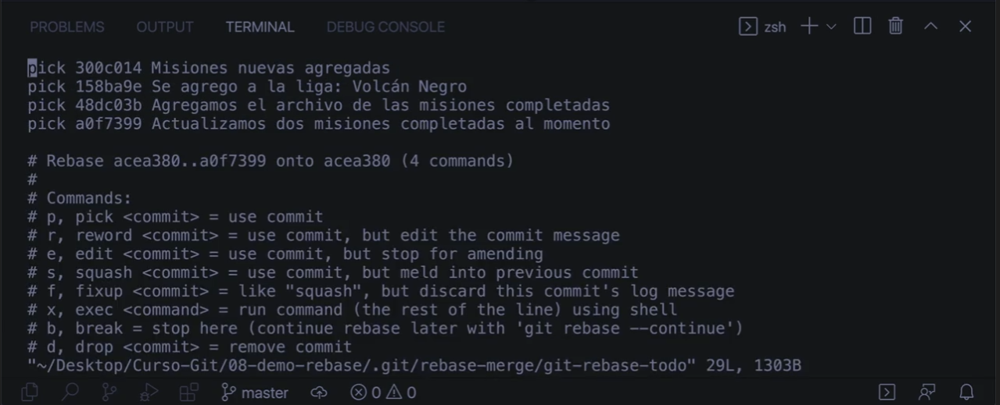
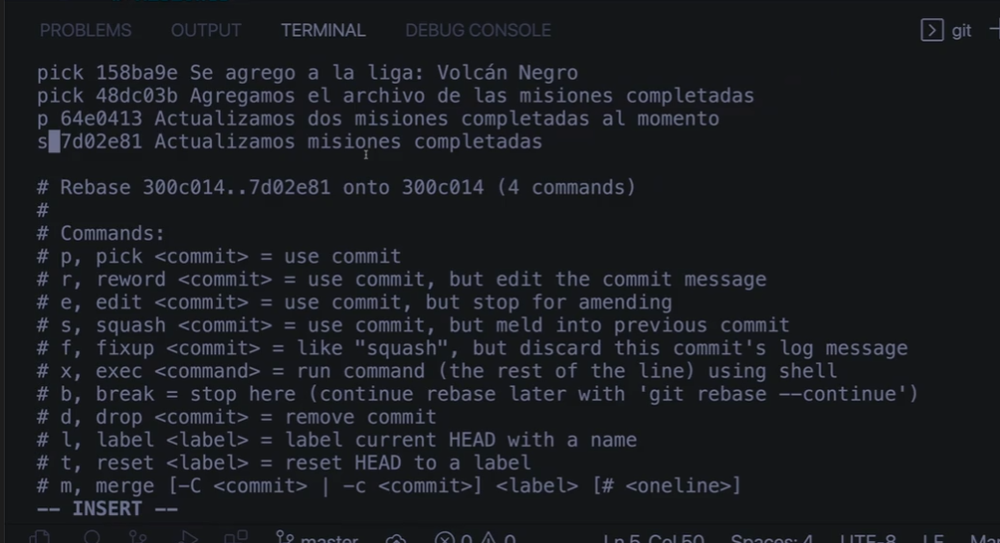

# Comandos GIT

## Configuración inicial

- Para inidicar localmente el nombre de usuario

  - `git config --global user.name "name"`
- Para indicar localmente el correo del usuario

  - `git config --global user.email "email"`
- Para indicar localmente el nombre de la rama principal de todos los repositorios futuros

  - `git config --global init.defaultBranch "branchName"`
- Para ver/editar la configuración global

  - `git config --global -e`
- Para corregir posible errores de CRLF (debo de estar ubicado en un repositorio git)

  - `git config core.autocrlf true`
- Para que no aparezca un warning al hacer un pull preguntando si deseo usar rebase o fast-forward

  - En este caso usaremos Fast-forward por defecto:
  - `git config --global pull.ff only`
  - En caso de que al hace un pull y hayan conflictos el fast-forward va a abortar y sera necesario cambiar la configuración del repositorio a: `git config pull.rebase true`
  - 
- Para eliminar archivos o carpetas que ya estan siendo rastreadas en el repositorio

  - `git rm --cached "path or fileName"`
- Para ignorar la basura de MAC

  - `find . -name .DS_Store -print0 | xargs -0 git rm --ignore-unmatch`
- para creat un .gitignore global que ignore siempre los .DS_Store

  ```console
  echo ".DS_Store" " ~/.gitignore_global
  echo "._.DS_Store" " ~/.gitignore_global
  echo "**/.DS_Store" " ~/.gitignore_global
  echo "**/._.DS_Store" " ~/.gitignore_global
  git config --global core.excludesfile ~/.gitignore_global
  ```

## ¿Cómo subir un proyecto local a un repositorio nuevo?

1. Primero, navega a la carpeta que deseas subir utilizando la línea de comandos. Puedes hacerlo con el comando cd, por ejemplo:
   `cd ruta/a/tu/carpeta`
2. Inicializa un nuevo repositorio de Git en esa carpeta con el comando git init:
   `git init`
3. Agrega todos los archivos en la carpeta al repositorio con el comando git add:
   `git add .`
4. Haz un commit de los archivos con el comando git commit. Asegúrate de agregar un mensaje de commit descriptivo:
   `git commit -m "Mi primer commit"`
5. Ve a GitHub y crea un nuevo repositorio. No inicialices el repositorio con un README, .gitignore o License. Solo dale un nombre y haz clic en “Create repository”.
6. En la página de tu nuevo repositorio, copia la URL del repositorio.
7. Vuelve a la línea de comandos y agrega la URL de tu repositorio como el “origin” remoto:
   `git remote add origin <tu_url_del_repositorio>`
8. Finalmente, sube tus archivos al repositorio con el comando git push:
   `git push -u origin main`

## Comandos básicos

### Reversar los cambios de un archivo antes del add

Podemos usar `git checkout -- <nombre-del-archivo>` para reversar todo los cambios hechos en este archivo. y que quede como estaba ne el ultimo commit.

### Renombrar Branch

- Para renombrar la rama actual:

  - `git branch -m <newname>`
- Para renombrar una rama mientras apunta a cualquier rama:

  - `git branch -m <oldname> <newname>`

__*-m* is short for  *--move* .__

### Status

- Para ver información sobre los "commits", sobre la rama en la que me encuentro actualmente, hace mención sobre los archivos a los que no se les esta haciendo seguimiento
  - `git status`

### Add

- Para añadir seguimiento a archivos en el repositorio

  - `git add "path or fileName"`
- Para añadir todos los cambios al "stage"

  - `git add .`

### Reset

- Para eliminar el seguimiento de un archivo o directorio

  - `git reset "path or fileName"`
- Para eliminar el ultimo commit

  - `git reset --soft HEAD^`
    - `--soft` con el SOFT no se eliminan los cambios
      `--mixed` MIXED no es destructivo, saca todo del stage y queda todo listo para volver a ser añadido.
      `--hard` con el HARD se eliminaran los cambios
    - `HEAD`: HEAD siempre apunta al ultimo commit
      `HEAD^`: Apunta al hash anterior al ultimo commit
      `HEAD^2`:Apunta al hash que del commit que se encuentra 2 puestos atras del HEAD,
      del mismo modo `HEAD^3` apuntara al commit anterior a este.

### Checkout

- Comando para reconstruir el proyecto a como estaba en el ultimo commit
  - `git checkout -- .`
  - TENER EN CUENTA QUE A LAS CARPETAS VACIAS NO SE LES HACE SEGUIMIENTO!

### Branch

- Para ver el nombre de la rama actual

  - `git branch`
- Para cambiar el nombre de la rama

  - `git branch -m "nombre actual" "nombre nuevo"` por ejemplo `git branch -m master main`

### Commit

- Para "tomar la fotografia" de el estado actual del repositorio

  - `git commit -m "mensaje descriptivo corto"`
- Para hacer un commit de archivos MODIFICADOS sin tener que escribir el "add" (no funciona con archivos UNTRACKED solo MODIFIED)

  - `git commit -am "el mensaje"`
  - NO FUNCIONA CON ARCHIVOS NUEVOS QUE AUN NO ESTAN SIENDO RASTREADOS
- Para modificar el mensaje del ultimo commit (--amend)

  - `git commit --amend -m "mensaje corregido"`
- Para ver información detallada de un commit

  - `git show <hash-del-commit>`

### Log

- Para mostrar el registro de todos los commits
  - `git log`

### reflog

- Muestra el historial de todo lo que se ha hecho con git
  - `git reflog`
    - se pueden utilizar los hash de los commits encontremos en este registro para retomar/reconstruir commit anteriores a pesar de que se hayan realizador procesos "destructivos" con reset --hard `git reset --hard <commit_hash>`, incluso se puede volver a un punto anterior a un merge de ramas.

### Move / Rename

- Se puede mover de lugar un archivo o renombrarlo si se deja en la misma ubicación pero con otro nombre
  - `git mv "archivo viejo.abc" "archivo nuevo.abc"`

### eliminar archivo

- Se pueden eliminar archivos con `git rm`
  - `git rm "nombre archivo.abc"`

### tags

Los tag son muy utiles para etiquetar commits importantes de las apps como por el ejmplo diferencias los versionamientos, los realeases, etc.

- Para crear un tag es necesario usar el siguiente comando
  - `git tag <nombre-del-tag>`
    - este comando añadira un tag en ek ultimo commit realizado (o el HEAD)
- para crear un tag en un commit anterior es necesario especificarlo
  - `git tag -a <nombre-del-tag> <hash-del-commit> -m "descripción del tag"`
- Para eliminar un tag
  - `git tag -d <nombre-del-tag>`
- Para ver la lista de tags
  - `git tag`
- Para ver información detallada de un tag especifico
  - `git show <nombre-del-tag>`

### Stash

Es algo así como una caja fuerte donde se almacenan cambios de forma segura para continuarlos después.

Lo recomendable es manejar un unico stash, pero es posible tener multiples stash.

Los stashes deben de ser considerados como un almacenamiento temporal y ser limpiados despues de cada sesión e trabajo o ser correctamente descriptos para evitar problemas y dolores de cabeza.

- Para almacenar los cambios que se han hecho desde el ultimo commit en el STASH

  - `git stash`
  - Esto se mostrara en el log con la para clave WIP (Work In Progress)
- Para almacenar los cambios al stash PERO CON UN NOMBRE (algo así como un mensaje del commit)

  - `git stash save "mensaje descriptivo del stash para evitar dolores de cabeza"`
- Para ver la lista de stash

  - `git stash list`
    - si agregamos la bandera `--stat` podremos ver descripciones de cada stash en la lista
- Para retomar la edición de el **stash en la posición 0**

  - `git stash pop`
- Para eliminar todos los stash

  - `git stash clear`
- Para eliminar un stash especifico

  - `git stash drop <nombre-del-stash>`
    - Para este caso el nombre seria algo como *stash@{0}* o *stash@{1}* o *stash@{2}* o uno similar, dependiendo de lo que muestre el `git stash list`
- Para ver los camibos que hay guardados en un stash especifico sin eliminarlo de la lista (apply)

  - `git stash apply <nombre-del-stash>`
    - Para este caso el nombre seria algo como *stash@{0}* o *stash@{1}* o *stash@{2}* o uno similar, dependiendo de lo que muestre el `git stash list`
- Para ver que archivo y cuantas lineas se modifican en cada stash (descripción vaga)

  - `git stash show <nombre-del-stash>`
    - Para este caso el nombre seria algo como *stash@{0}* o *stash@{1}* o *stash@{2}* o uno similar, dependiendo de lo que muestre el `git stash list`

## Creando alias

### Status con alias 'git s'

- Para escribir mas rapido el `git status`
  - `git config --global alias.s "status --short"` o `git config --global alias.s "status -sb"`

### Log con alias 'git lg'

- Para un `git log` mas visual
- `git config --global alias.lg "log --graph --abbrev-commit --decorate --format=format:'%C(bold blue)%h%C(reset) - %C(bold green)(%ar)%C(reset) %C(white)%s%C(reset) %C(dim white)- %an%C(reset)%C(bold yellow)%d%C(reset)' --all"`

## Submodulos

Los submodulos son repositorios que viven dentro de un repositorio (el 'superproyecto')

Para añadir un submodulo primero ese repositorio debe de existir en un repositorio remoto de github para poder ingresar la URL en el comando:
`git submodule add <url> <submodule-path>`

### Agregar un submodulo

Para agregar un submodulo se debe usar el código
`git submodule add <url> <submodule-path>`

### Configuración recursiva de los modulos

En el momento en el que hace un comando push/pull o otros en el superproyecto este puede ser recursivo o no y se decide con la inclusión de la bandera "--recurse-submodules"
`git <command> --recurse-submodule (check|on-demand|only|no)`

En el caso de que se desee que siempre sea recursivo se puede cambiar la configuración del superproyecto con este código.
`git config submodule.recurse true`

### En caso de que se clone un superproyecto

Para que traiga todo el contenido de los submodulos es necesario usar la bandera "--recurse-submodules"
`git clone <repository-URL> --recurse-submodule ()`

en caso de que no se use se traera unicamente la carpeta de los submodulos pero estaran vacias.

se puede traer el contenido de estos módulos vacíos con este código.
`git submodule update --init`

## Rebase

### Rebase normal

El rebase nos permite cambiar el lugar donde se origino un commit?

hagamos de cuenta que tenemos la rama 'main' y una rama adicional llamada 'otra' ynecesitamos que la rama 'otra' se actualice con unos commits que se hicieron en 'master' DESPUES de el lugar de donde se bifurco, ¿Cómo podriamos actualizar la rama 'otra' con los ultimos commits de 'main'?

podemos usar:

```console
git checkout otra
git rebase main
```

lo que haría este código es:

- poner cada uno de los commits de la rama 'otra' en un area temporal
- mover el puntero de la rama 'otra' al ultimo commit de la rama 'main'
- va a regresar los commits que estaban en el area temporal a la rama 'otra'

### Rebase interactivo

`git rebase -i HEAD~<numeroDeCommitsHaciaAtrás>`

por ejemplo: `git rebase -i HEAD~3` haria un rebase interactivo con los últimos 3 commits.

Esto crearía un area temporal donde se almacenan los últimos 3 commits y luego los re ingresa en el orden en que hayan ingresado al area temporal

**Al realizar un rebase interactivo con los ultimos (por ejemplo 4 commits) nos aparecera una nueva vista en la consola que nos muestra una lista de los commits elegidos, al inicio de cada uno habra una palabra clave que determina que se hace con cada una (por defecto es 'pick' o 'p') y abajo de la lista nos mostrará una lista de palabras clave que podremos usar como ayuda para saber que hacer con cada uno de los commits elegidos en el rebase.**



#### Usos más comunes del rebase interactivo

- Ordenar commits
- Corregir mensajes en los commits
- Unir Commits
- Separar Commits

#### SQUASH

si usamos la palabra 'squash' o 's' como comando al inicio un commit, combinará ese commit junto con el anterior (OJO, si se usa el squash en mas de 1 commit entonces se combinaran mas de 2 commits)


en este caso se hace un squash (union de 2 commits) con los ultimos 2 commits.

#### REWORD

si usamos la palabra 'reword' o 'r' como comando al inicio un commit, cambiaremos el mensaje de cada uno de los commits a los que le hayamos puesto esta palabra.

#### EDIT

si usamos la palabra 'edit' o 'e' como comando al inicio un commit, entraremos al modo rebase manual permitiendonos usar `git reset HEAD^` o  de ese modo podremos separar los commmits en los que usamos 'edit' en varias partes, por ejemplos separar la edicion de 2 archivos en 2 commits diferentes añadiendo cada uno por separado con `git add <nombre-archivo>` y `git commit -m "el mensaje"` y luego añadir los archivos restantes y hacer commit. Al finalizar la separación de estos commits __ES IMPORTANTE FINALIZAR CON `git rebase --continue` para continuar el rebase__ o finalizarlo en caso de que sea el ultimo.

## Push

El comando inicial que se usa para hacer un push a un repositorio remoto es

`git retome add <name> <remote-repo-url>`

* `<name>` suele tener el  nombre de origin pero puede ser cualquier otro nombre
* `<remote-repo-url>` debe ser la URL de un repositorio remoto previamente creado
* se pueden añadir mas de un repositorio remoto al repositorio local y para eso se le ponen diferentes `<name>` a cada url remota añadida

El siguiente comando es

`git push -u <remote-name> <branch-name>`

* `-u` es el corto de `--set-upstream` y lo que hace es que estamos definiendo el remote y la branch por defecto para cada push, de modo que la siguiente vez solo sea necesario usar `git push` sin especificar el remote ni la rama, sin embargo se pueden especificar si no se desea hacer push a el remote/branch por defecto.
* `<remote-name>` suele ser "origin"
* `<brancg-name>` suele ser "main"
